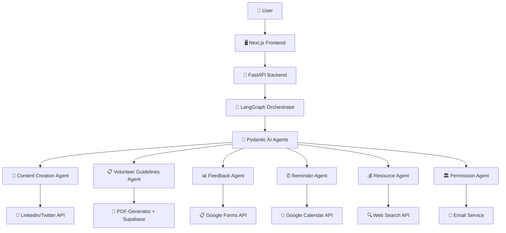

# 🌍 Mahanayak

<div align="center">
<!-- Hero Banner -->

<br/>

<!-- Badges -->
<p>
  
  
  
</p>

</div>

---

## 🌟 Overview

**Mahanayak** is an AI-powered environmental event management platform that leverages **agentic AI** to streamline the planning, execution, and management of environmental drives. From tree plantation campaigns to beach cleanups, 6 specialized AI agents work in coordination to make environmental initiatives more impactful and efficient.

<div align="center">

```
🌱 Plant → 🤖 Plan → 🚀 Execute → 📊 Measure → 🌍 Impact
```

</div>

---

## 🏗️ Architecture



---

## 🎯 Key Features

<table>
<tr>
<td width="50%">

### 🤖 **Intelligent Agent Orchestra**
- ✨ **6 Specialized AI Agents** working in coordination
- 🧠 **Pydantic AI** for individual agent intelligence  
- 🔗 **LangGraph** for seamless agent orchestration
- ⚡ **Dynamic workflow adaptation** based on event requirements

</td>
<td width="50%">

### 🛠️ **Comprehensive Automation**
- 📝 **Content Creation** with social media integration
- 🏛️ **Government Permission** handling with automated emails
- 💰 **Resource Optimization** with real-time price monitoring
- 👥 **Volunteer Management** with PDF guidelines generation

</td>
</tr>
<tr>
<td colspan="2">

### 🌐 **End-to-End Integration**
- ⏰ **Smart Reminders** with Google Calendar integration
- 📊 **Feedback Collection** with automated Google Forms
- 📱 **Real-time Notifications** across multiple channels
- 📈 **Impact Analytics** with comprehensive reporting

</td>
</tr>
</table>

---

## 🤖 AI Agents & Tools

<div align="center">

### **🎭 The AI Agent Squad**

</div>

<table align="center">
<tr>
<td width="50%">

#### 📝 **Content Creation Agent**
```yaml
Purpose: Generate compelling social content
Tools: 
  - 🔗 LinkedIn API Integration
  - 🐦 Twitter API Integration
  - 📱 Multi-platform Publishing
Output: 
  - Professional posts
  - Awareness campaigns
  - Promotional content
```

#### 📊 **Feedback Agent**
```yaml
Purpose: Collect & analyze feedback
Tools:
  - 📋 Google Forms API
  - 📈 Analytics Dashboard
  - 🎯 Custom Surveys
Output:
  - Automated forms
  - Participation metrics
  - Impact analysis
```

#### 💰 **Resource Agent**
```yaml
Purpose: Optimize budget & resources
Tools:
  - 🔍 Web Search API
  - 💹 Price Comparison
  - 📊 Cost Analytics
Output:
  - Cost estimates
  - Vendor comparisons
  - Resource optimization
```

</td>
<td width="50%">

#### 📋 **Volunteer Guidelines Agent**
```yaml
Purpose: Create volunteer documentation
Tools:
  - 📄 PDF Generator
  - 💾 Supabase Storage
  - 🎨 Document Designer
Output:
  - Interactive handbooks
  - Safety guidelines
  - Training materials
```

#### ⏰ **Reminder Agent**
```yaml
Purpose: Manage schedules & notifications
Tools:
  - 📅 Google Calendar API
  - 📧 Notification Service
  - ⏰ Smart Scheduling
Output:
  - Event reminders
  - Milestone alerts
  - Timeline management
```

#### 🏛️ **Permission Agent**
```yaml
Purpose: Handle government approvals
Tools:
  - 📧 Email Service
  - 📄 Document Generator
  - 🏛️ Gov Portal Integration
Output:
  - Permission letters
  - Authority communications
  - Compliance reports
```

</td>
</tr>
</table>

---

## 🤖 Autonomous AI Workflow


---

## 🚀 Tech Stack

<div align="center">

### **Frontend**


### **Backend & AI**


### **Database & Storage**


### **Integrations**


</div>

<table align="center">
<tr>
<th>Category</th>
<th>Technology</th>
<th>Purpose</th>
</tr>
<tr>
<td rowspan="3">🎨 <strong>Frontend</strong></td>
<td></td>
<td>React framework with SSR</td>
</tr>
<tr>
<td></td>
<td>AI-powered UI components</td>
</tr>
<tr>
<td></td>
<td>Utility-first CSS framework</td>
</tr>
<tr>
<td rowspan="2">⚡ <strong>Backend</strong></td>
<td></td>
<td>High-performance Python API</td>
</tr>
<tr>
<td></td>
<td>Core backend language</td>
</tr>
<tr>
<td rowspan="2">🤖 <strong>AI & ML</strong></td>
<td></td>
<td>Individual AI agent framework</td>
</tr>
<tr>
<td></td>
<td>Agent orchestration platform</td>
</tr>
<tr>
<td rowspan="2">💾 <strong>Database</strong></td>
<td></td>
<td>Primary database</td>
</tr>
<tr>
<td></td>
<td>File storage & public URLs</td>
</tr>
</table>

---

## 🛠️ Installation & Setup

<div align="center">

### **⚡ Quick Start Guide**

</div>

> **Prerequisites**: Python 3.9+, Node.js 16+, pnpm, uv package manager

<table>
<tr>
<td width="50%">

### 🔧 **Backend Setup**

```bash
# 1️⃣ Clone the repository
git clone https://github.com/satyam7535/mahanayak.git
cd mahanayak

# 2️⃣ Navigate to backend
cd backend

# 3️⃣ Install dependencies
uv sync

# 4️⃣ Configure environment
cp .env.example .env
# Edit .env with your API keys

# 5️⃣ Launch backend server
uv run run.py
```

</td>
<td width="50%">

### 🎨 **Frontend Setup**

```bash
# 1️⃣ Navigate to frontend
cd frontend

# 2️⃣ Install dependencies
pnpm install

# 3️⃣ Start development server
pnpm run dev

# 🚀 Open http://localhost:3000
```

</td>
</tr>
</table>

<div align="center">

### **🎉 You're all set! Start creating environmental impact!**

</div>

---

## 🤝 Contributing

Contributions are welcome! Whether it's bug reports, feature requests, code contributions, or documentation improvements — feel free to open an issue or submit a pull request.

```bash
# 1️⃣ Fork the repository
# 2️⃣ Create your feature branch
git checkout -b feature/AmazingFeature

# 3️⃣ Commit your changes
git commit -m '✨ Add some AmazingFeature'

# 4️⃣ Push to the branch
git push origin feature/AmazingFeature

# 5️⃣ Open a Pull Request
```

---

## 📄 License

<div align="center">

This project is licensed under the **MIT License** - see the [LICENSE](LICENSE) file for details.

[](https://opensource.org/licenses/MIT)

</div>

---

<div align="center">

<!-- Footer Banner -->


### **🌍 Made with 💚 for the planet**

**Built by [Satyam](https://github.com/satyam7535)**

</div>
